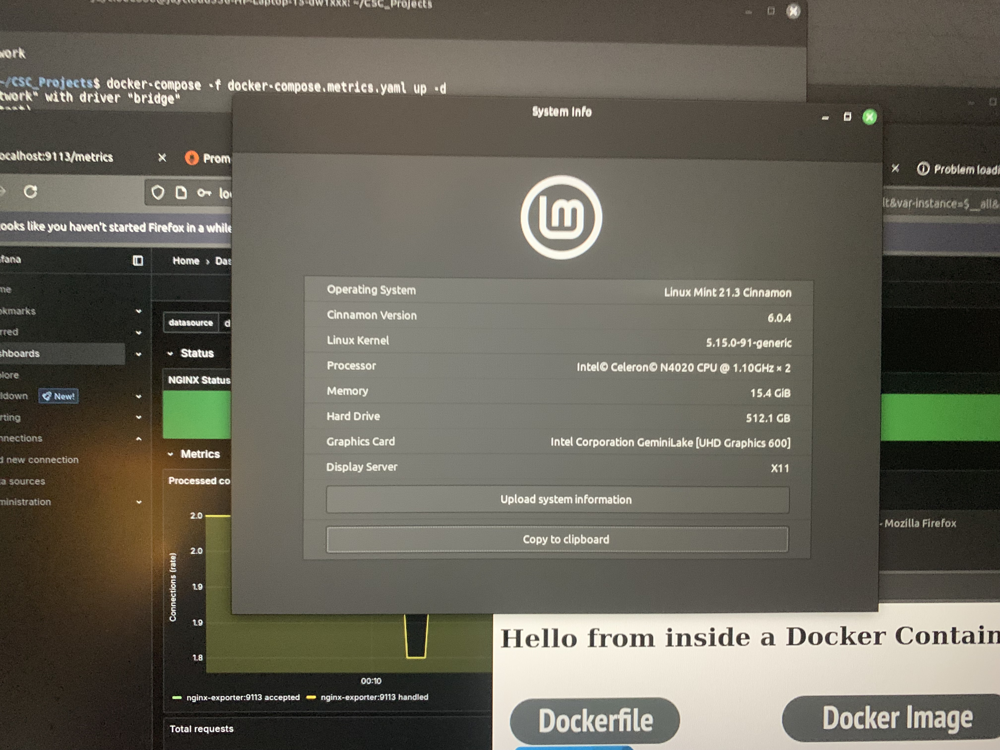
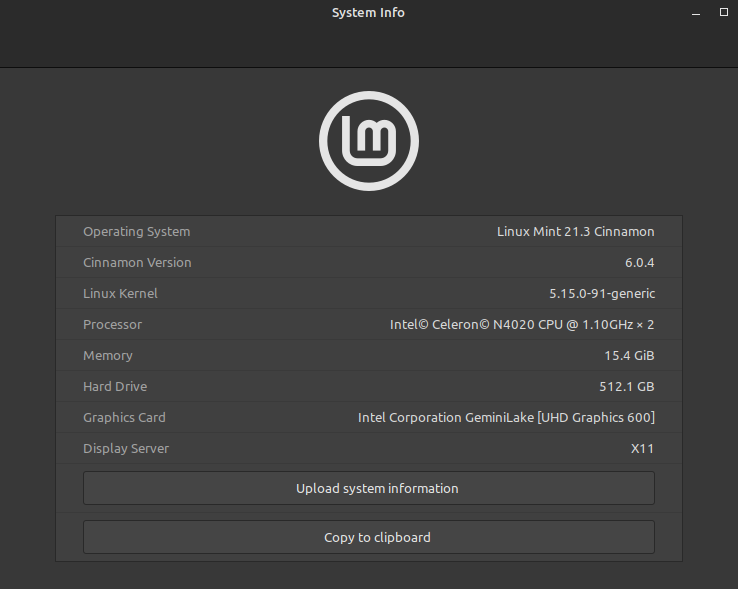
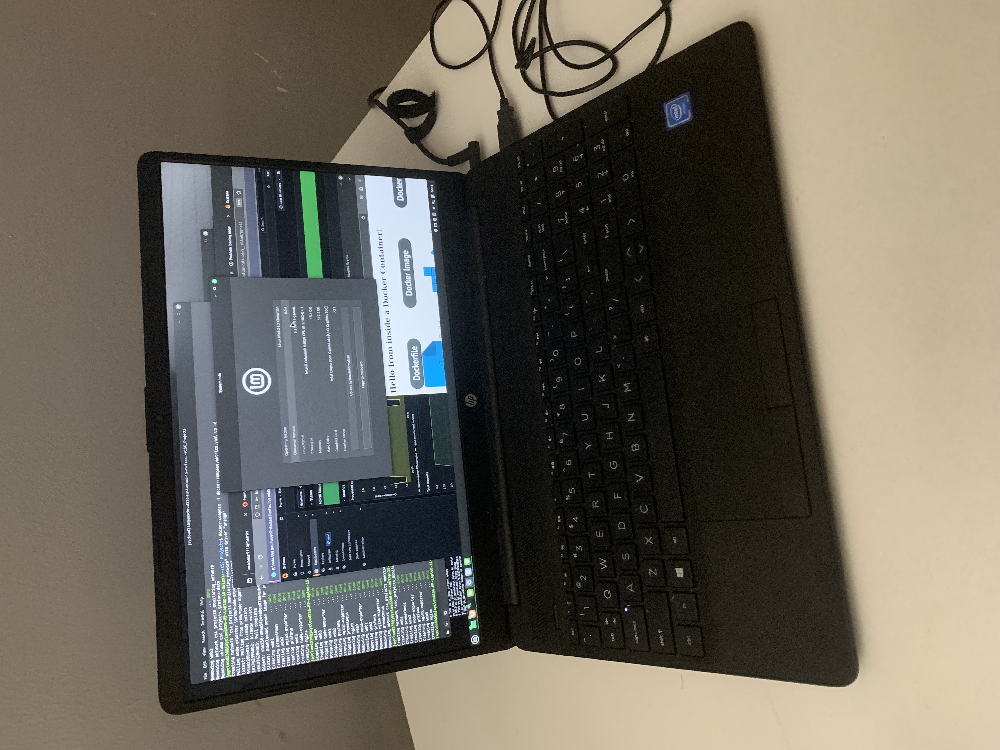
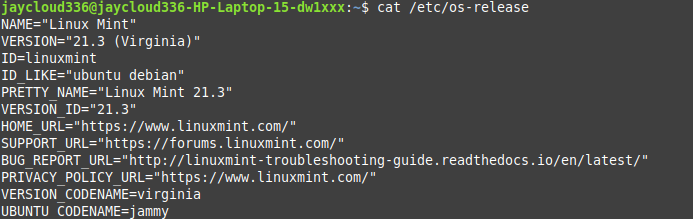
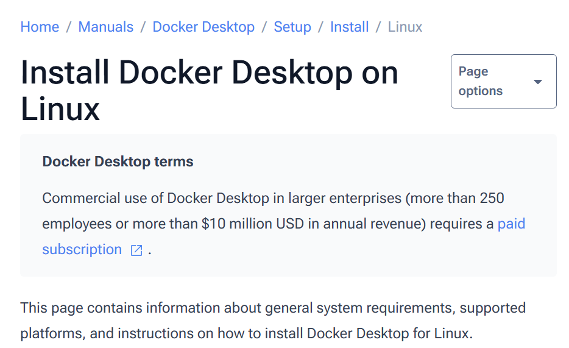
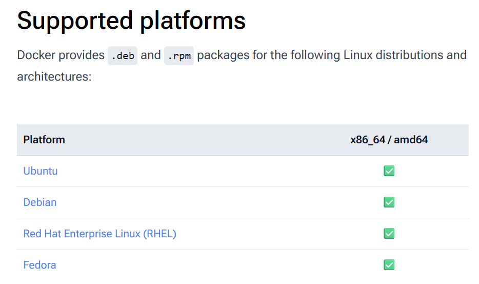
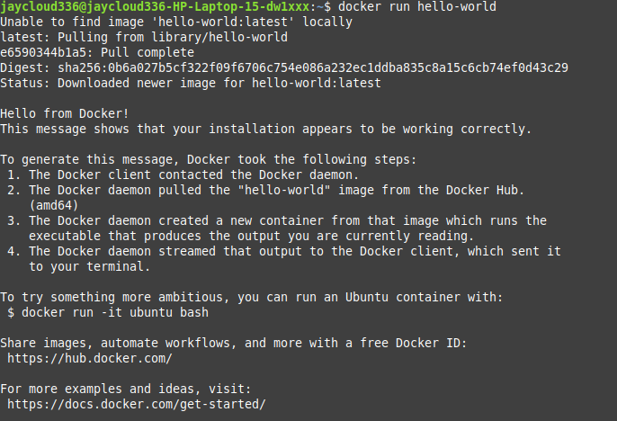

# 🐳 Docker Lab: Container Operations & Environment Setup

This lab is a personal deep-dive into core Docker functionality—running containers, inspecting images, and managing containerized apps—on a non-enterprise Linux environment. I chose to use **Linux Mint 21.3 (Virginia)** for this project to better understand how Docker behaves on different distros, especially those not commonly used in production environments like CentOS or Ubuntu Server.
<p align="center">
  
</p>


Although Mint is more desktop-oriented, it's built on **Ubuntu 22.04 LTS**, which itself is based on **Debian**—so most Docker functionality works out of the box with only minor configuration differences.

For this setup, I installed Linux Mint 21.3 (Virginia)—the latest stable release at the time—from the official Linux Mint website. Having a clean, fresh system made it easier to focus on Docker and container experimentation outside of my daily workstation.

---
<p align="center">
  
</p>


## 🖥️ System Environment

Here’s the system I ran this project on:

```bash
jaycloud336@jaycloud336-HP-Laptop-15-dw1xxx:~$ lsb_release -a
No LSB modules are available.
Distributor ID:	Linuxmint
Description:	Linux Mint 21.3
Release:	21.3
Codename:	virginia
```


<p align="center">
  
</p>


```bash
jaycloud336@jaycloud336-HP-Laptop-15-dw1xxx:~$ cat /etc/os-release
NAME="Linux Mint"
VERSION="21.3 (Virginia)"
ID=linuxmint
ID_LIKE="ubuntu debian"
PRETTY_NAME="Linux Mint 21.3"
VERSION_ID="21.3"
UBUNTU_CODENAME=jammy
```


For this project, I repurposed an older HP laptop as a dedicated Linux test environment. I love hunting for used laptops on eBay and other sites, then installing alternative operating systems on them. It’s a great, affordable way to build home labs and get hands-on experience with different OS environments.


> 🧠 **I like to think of Linux like this:**
>
> - **Debian** = the engine  
> - **Ubuntu** = the car built with that engine  
> - **Linux Mint** = the same car, with a different dashboard and user interface  
>
> While Linux Mint isn’t typically used in server environments, it worked great as a testing ground for this Docker lab.

---

## 🔧 Prerequisites

Before starting, I made sure Docker was installed and running. Since I was working on Linux Mint (Ubuntu-based), I followed the official instructions for [Docker on Ubuntu](https://docs.docker.com/engine/install/ubuntu/).

Installing Docker is pretty straightforward—mainly researching the proper OS and system requirements, then selecting the correct installation image for your system. Following official docs helps ensure a smooth setup.

https://docs.docker.com/desktop/setup/install/linux/





After installation, I verified the version:

```bash
$ docker --version
Docker version 24.0.5, build ced0996
```
I also ran a celebratory "Hello World" container..lol



> ⚠️ **Note:** There are newer Docker versions available now, including for non-Linux platforms. This was the version current at the time of my setup.

> 💡 **Note:** On Windows and macOS, Docker can be installed via package managers like Chocolatey (Windows) or Homebrew (macOS). On Linux, package managers like `apt`, `dnf`, or `pacman` can also install Docker (`docker.io` or `docker` packages). 

> While using your Linux distribution’s package manager is often the most convenient option, the official Docker installation from Docker’s repositories is generally recommended to get the latest features and updates.
