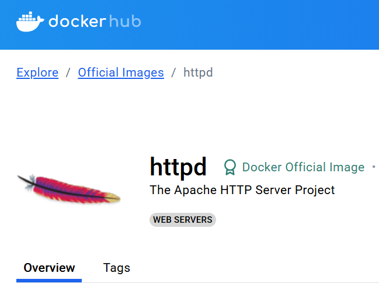
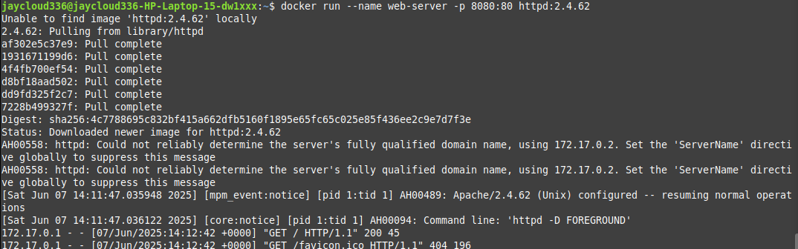
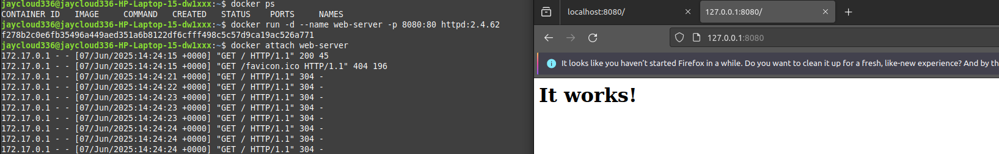
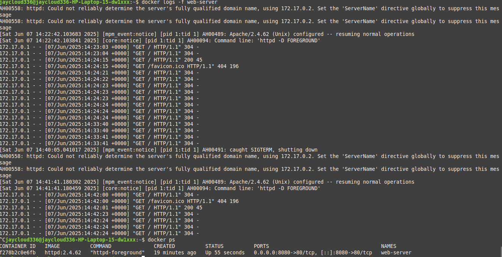
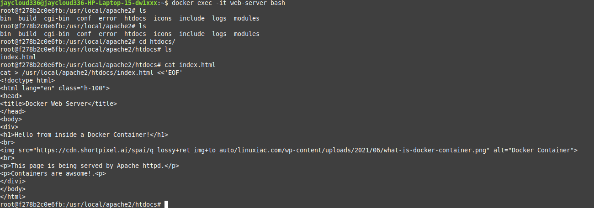
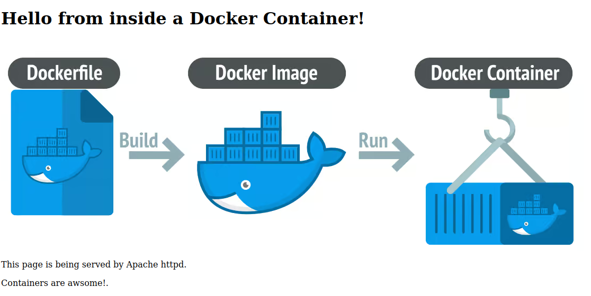

## 1. Running and Observing a Web Server Container (httpd)

I began by running a simple Apache HTTP Server container.

* Run `httpd` container in foreground:  
I ran the `httpd` container (version 2.4.62) mapping port 8080 on my local machine to port 80 in the container. I named the container "web-server".

```bash
docker run -p 8080:80 --name web-server httpd:2.4.62
```

*Expected Output:* Apache httpd server logs streamed in my terminal.

* Open browser:  
I opened my browser and navigated to http://localhost:8080  
Expected Result: The page showed "It works!"  
Action: Pressed Ctrl+C in the terminal to stop the container.

* Stop and delete the container:  
To clean up, I stopped and removed the container.

```bash
docker stop web-server
docker rm web-server
```

*Expected Output:*  
```
web-server
web-server
```

* Run `httpd` container in background (detached) mode:  
I ran the `httpd` container again, this time detached.

```bash
docker run -d -p 8080:80 --name web-server httpd:2.4.62
```


*Expected Output:* A long container ID was printed.

* Attach to the container's logs:  
I attached to the container to view logs.

```bash
docker attach web-server
```

Action: Visited http://127.0.0.1:8080 in my browser and refreshed multiple times. Logs appeared in the terminal for each refresh.  
Action: Pressed Ctrl+C to stop attaching; container continued running.
*Note:* `localhost` and `127.0.0.1` both point to your local machine's loopback interface. They behave the same for accessing local services.

* Tail the container's logs:  
I used `docker logs -f` to follow the logs.

```bash
docker logs -f web-server
```

Action: Refreshed the browser multiple times; new logs appeared.  
Action: Pressed Ctrl+C to stop tailing; container kept running.

* Difference between `attach` and `tail`:  
- `docker attach` connects your terminal to container's input/output. Stopping it stops the container.  
- `docker logs -f` streams output only; stopping it does not stop the container.

* Modify content inside the container:  
I stopped and removed the container, then ran it again detached.

```bash
docker stop web-server && docker rm web-server
docker run -d -p 8080:80 --name web-server httpd:2.4.62
```

I entered the container shell:

```bash
docker exec -it web-server bash
```


Inside, I replaced the default index content:

```bash
echo "Hello, world!" > /usr/local/apache2/htdocs/index.html
exit
```

Action: Refreshed http://localhost:8080 — it showed "Hello, world!" instead of "It works!".

* Inspect the container:  
I inspected the container to see details.

```bash
docker inspect web-server
```

Looked for:  
- "IPAddress" under "Networks"  
- "ExposedPorts" under "Config"  
- "WorkingDir" under "Config"  
- "Cmd" or "Entrypoint" under "Config"

* Copy local file into the container:  
On my local machine, I created a new index file:

```bash
echo "Containers are awesome!" > index.html
```

Then copied it into the running container:

```bash
docker cp index.html web-server:/usr/local/apache2/htdocs/index.html
```

Action: Refreshed http://localhost:8080 — it showed "Containers are awesome!".


## Customizing the index.html Inside the Docker Container

You can change the index file as you wish to customize the web page served by Apache httpd inside the container.

I replaced the default index.html with the following content using a here-document:

```bash
cat > /usr/local/apache2/htdocs/index.html <<'EOF'
<!doctype html>
<html lang="en" class="h-100">
<head>
<title>Docker Web Server</title>
</head>
<body>
<div>
<h1>Hello from inside a Docker Container!</h1>
<br>

<br>
<p>This page is being served by Apache httpd.</p>
<p>Containers are awsome</p>
</div>
</body>
</html>
EOF
```

After running this, when I refresh the browser at http://localhost:8080, I see the customized page with the heading, image, and text.



---

### Useful Commands: (server name= 'web-server')

Here are some cool Docker commands I used in this project:

```bash
docker run --name web-server -p 8080:80 httpd:2.4.62
docker stop web-server
docker restart web-server
docker attach web-server
docker logs -f web-server
docker exec -it web-server bash
```
#### Index.html changes inside the container shell: (example)
`echo "Hello World" > /usr/local/apache2/htdocs/index.html
`
