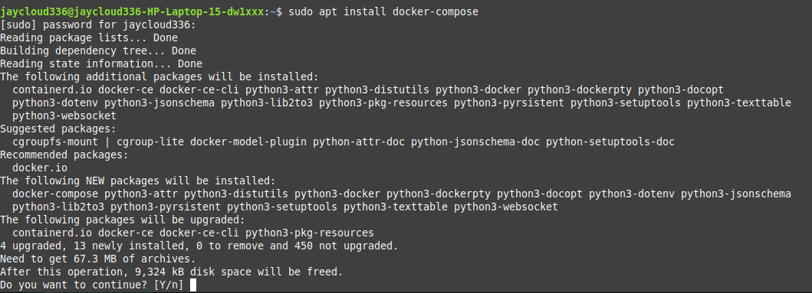
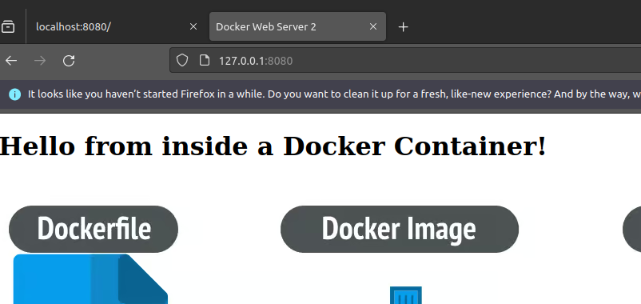
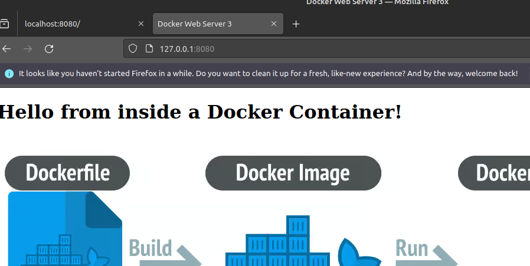

## 3. Working with Multiple Containers Using Docker Compose

At this point, I wanted to scale things up and explore how to manage multiple containers more cleanly. Instead of manually running and linking containers, I switched to using `docker-compose` — which lets me define all services in a single YAML file and spin everything up with just one command.

In this setup, I’m running **three Apache containers** (`web1`, `web2`, `web3`) — each with its own custom index page. On top of that, I added **NGINX** as a reverse proxy (or ingress controller) to act as a front-facing load balancer. It receives all HTTP requests and distributes them to the backend containers using round-robin load balancing.

This is s bit closer to a real-world microservice architecture where you might have multiple instances of a service and need a unified entry point.

With `docker-compose`, I don’t have to worry about manually wiring up ports or restarting everything one by one. It’s clean, declarative, and super easy to manage.

***docker compose needs to be installed on your local sytem first!***

you can run: 

`docker compose version` to check

if it is not installed you can run:

`sudo apt install docker-compose`




## Setting Up My Multi-Container App with Docker Compose

To start, I created a simple directory structure simlr to this in order to hold everything I needed:

```
docker_project/
├── docker-compose.yml
├── nginx.conf
├── index1.html
├── index2.html
├── index3.html
```

### `docker-compose.yml`

This file defines 4 services: three Apache containers (`web1`, `web2`, `web3`), and one NGINX container that serves as the front-facing load balancer. Each Apache container serves its own custom `index.html`, and NGINX proxies incoming requests to them using round-robin.

`docker-compose.yml`

```bash
version: "3"
services:
  web1:
    image: httpd:2.4
    container_name: web1
    expose:
      - "80"
    volumes:
      - ./index1.html:/usr/local/apache2/htdocs/index.html

  web2:
    image: httpd:2.4
    container_name: web2
    expose:
      - "80"
    volumes:
      - ./index2.html:/usr/local/apache2/htdocs/index.html

  web3:
    image: httpd:2.4
    container_name: web3
    expose:
      - "80"
    volumes:
      - ./index3.html:/usr/local/apache2/htdocs/index.html

  nginx:
    image: nginx:latest
    container_name: nginx
    ports:
      - "8080:80"
    volumes:
      - ./nginx.conf:/etc/nginx/nginx.conf:ro
    depends_on:
      - web1
      - web2
      - web3
```

###  `nginx.conf`

This config tells NGINX to act as a load balancer (reverse-proxy). It defines an upstream block with the three backend servers, and forwards all incoming traffic to them.

`nginx.conf`

```bash
events {}

http {
    upstream backend_servers {
        server web1:80;
        server web2:80;
        server web3:80;
    }

    server {
        listen 80;

        location / {
            proxy_pass http://backend_servers;
        }
    }
     }

```

### My Custom Index Pages

Each HTML file is nearly identical, but I gave each one a unique title so I could tell which backend was handling the request just by checking the browser tab.

`index1.html`

***I changed the following line of code in each index.html file:***

```bash
<!doctype html>
<html lang="en" class="h-100">
<head>
<title>Docker Web Server 1</title>
</head>
```

---

### Running Everything

Once everything was in place, I ran:

`bash
docker compose up -d`


Then I opened my browser at:

```bash
http://localhost:8080
```

Each time I refreshed the page, I saw a different backend header title in my browser — confirming that NGINX was doing round-robin load balancing across all three Apache containers. Hooray!


  

At this point you can run: `docker compose down -v`

---

### Useful Commands:

```bash
docker compose up -d
docker compose down -v
```
