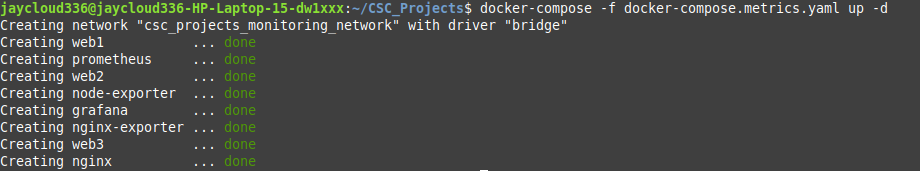

## Part 4: Adding Observability with Docker Compose

Now that I had my multi-container setup running with Apache and NGINX, I wanted to add **observability** — basically, a way to see what's going on under the hood.

To keep it clean, I created a single compose file that handles everything — both the original services **and** the monitoring tools. I called it:

```bash
docker-compose.metrics.yaml
```

Then I launched the whole stack with:

```bash
docker compose -f docker-compose.metrics.yaml up -d
```

This spun up all my web servers **plus** monitoring tools like **Prometheus**, **Grafana**, and some exporters.

---

### What This Compose File Does (Plain English)

Here’s how I understand it:

- I included my `web1`, `web2`, and `web3` services — same Apache image, but now with an extra config file: `status.conf`. That enables Apache’s `/server-status` endpoint so Prometheus can pull metrics from them.

- My `nginx` service is still reverse-proxying the 3 Apache servers, like before.

- I added **nginx-exporter**, which talks to NGINX and exposes its internal metrics on port `9113`.

- I added **Prometheus**, which scrapes metrics from all exporters. It uses a config file I made called `prometheus.yaml`.

- I added **Grafana**, which gives me dashboards to visualize the data. It runs on port `3000`, and I set the default admin password to `admin`.

- I also added **node-exporter**, which exposes system-level metrics from the host machine — things like CPU, memory, and disk usage.

All the services are connected through a shared virtual network:

```yaml
networks:
  monitoring_network:
    driver: bridge
```

That way, they can talk to each other by name — like `web1`, `prometheus`, `grafana`, etc.

---

### Folder Structure

Here’s how my project folder looks now:

```bash
my-compose-app/
├── docker-compose.metrics.yaml     # All services (web + monitoring)
├── prometheus.yaml                 # Prometheus scrape config
├── nginx.conf                      # Load balancer config
├── index1.html
├── index2.html
├── index3.html
├── status.conf                     # Apache status module config
```

---

## Phase 4: Adding Observability with Docker Compose

Now that I had my multi-container setup running with Apache and NGINX, I wanted to add **observability** — basically, a way to see what's going on under the hood.

To keep it clean, I created a single compose file that handles everything — both the original services **and** the monitoring tools. I called it:

'''
docker-compose.metrics.yaml
'''

Then I launched the whole stack with:

'''bash
docker compose -f docker-compose.metrics.yaml up -d
'''

This spun up all my web servers **plus** monitoring tools like **Prometheus**, **Grafana**, and some exporters.

---

`docker-compose.metrics.yaml` 

```yaml
version: '3.8'

services:
  web1:
    image: httpd:2.4
    container_name: web1
    expose:
      - "80"
    volumes:
      - ./index1.html:/usr/local/apache2/htdocs/index.html
      - ./status.conf:/usr/local/apache2/conf/extra/status.conf
    networks:
      - monitoring_network

  web2:
    image: httpd:2.4
    container_name: web2
    expose:
      - "80"
    volumes:
      - ./index2.html:/usr/local/apache2/htdocs/index.html
      - ./status.conf:/usr/local/apache2/conf/extra/status.conf
    networks:
      - monitoring_network

  web3:
    image: httpd:2.4
    container_name: web3
    expose:
      - "80"
    volumes:
      - ./index3.html:/usr/local/apache2/htdocs/index.html
      - ./status.conf:/usr/local/apache2/conf/extra/status.conf
    networks:
      - monitoring_network

  nginx:
    image: nginx:latest
    container_name: nginx
    ports:
      - "80:80"  # Main entry point
    volumes:
      - ./nginx.conf:/etc/nginx/nginx.conf
    depends_on:
      - web1
      - web2
      - web3
    networks:
      - monitoring_network

  nginx-exporter:
    image: nginx/nginx-prometheus-exporter:latest
    container_name: nginx-exporter
    command:
      - "-nginx.scrape-uri=http://nginx/nginx_status"
    ports:
      - "9113:9113"
    networks:
      - monitoring_network

  prometheus:
    image: prom/prometheus:latest
    container_name: prometheus
    ports:
      - "9090:9090"
    volumes:
      - ./prometheus.yaml:/etc/prometheus/prometheus.yml
    networks:
      - monitoring_network

  grafana:
    image: grafana/grafana:latest
    container_name: grafana
    ports:
      - "3000:3000"
    environment:
      - GF_SECURITY_ADMIN_PASSWORD=admin
    networks:
      - monitoring_network

  node-exporter:
    image: prom/node-exporter:latest
    container_name: node-exporter
    ports:
      - "9100:9100"
    networks:
      - monitoring_network

networks:
  monitoring_network:
    driver: bridge

```


---
### What This Compose File Does (Plain English)

Here’s how I understand it:

- I included my `web1`, `web2`, and `web3` services — same Apache image, but now with an extra config file: `status.conf`. That enables Apache’s `/server-status` endpoint so Prometheus can pull metrics from them.

- My `nginx` service is still reverse-proxying the 3 Apache servers, like before.

- I added **nginx-exporter**, which talks to NGINX and exposes its internal metrics on port `9113`.

- I added **Prometheus**, which scrapes metrics from all exporters. It uses a config file I made called `prometheus.yaml`.

- I added **Grafana**, which gives me dashboards to visualize the data. It runs on port `3000`, and I set the default admin password to `admin`.

- I also added **node-exporter**, which exposes system-level metrics from the host machine — things like CPU, memory, and disk usage.

All the services are connected through a shared virtual network:

'''yaml
networks:
  monitoring_network:
    driver: bridge
'''

That way, they can talk to each other by name — like `web1`, `prometheus`, `grafana`, etc.

---

### Folder Structumre

Here’s an example project direcotry structure:

```
docker-project/
├── docker-compose.metrics.yaml     # All services (web + monitoring)
├── prometheus.yaml                 # Prometheus scrape config
├── nginx.conf                      # Load balancer config
├── index1.html
├── index2.html
├── index3.html
├── status.conf                     # Apache status module config
```

---


## New Monitoring-related additions: prometheus.yaml and status.conf

Here’s what I have inside my Prometheus scrape config file, `prometheus.yaml`:

```.conf
global:
  scrape_interval: 5s

scrape_configs:
  - job_name: 'prometheus'
    static_configs:
      - targets: ['localhost:9090']

  - job_name: 'nginx-exporter'
    static_configs:
      - targets: ['nginx-exporter:9113']

  - job_name: 'nginx-direct'
    static_configs:
      - targets: ['nginx:80']
        labels:
          group: "nginx"

  - job_name: 'httpd-services'
    static_configs:
      - targets: ['web1:80', 'web2:80', 'web3:80']

  - job_name: 'node-exporter'
    static_configs:
      - targets: ['node-exporter:9100']
```

---

And here’s my Apache `status.conf` that I mount inside each Apache container:

```
# Load the status module
LoadModule status_module modules/mod_status.so

# Enable extended status (IMPORTANT for detailed metrics)
ExtendedStatus On

# Enable server status page
<Location "/server-status">
    SetHandler server-status
    # Allow access from anywhere (for Docker containers)
    Require all granted
</Location>

# Optional: Also enable server info (useful for debugging)
<Location "/server-info">
    SetHandler server-info
    Require all granted
</Location>
```

---

### What these new addtions do:

- In `prometheus.yaml`, tells Prometheus how often to scrape metrics (`5s`), and where to find them:

  - Prometheus scrapes itself on `localhost:9090`.

  - It scrapes NGINX metrics via the `nginx-exporter` on port `9113`.

  - It scrapes NGINX directly on port `80` for basic stats.

  - It scrapes each Apache server (`web1`, `web2`, `web3`) on port `80`.

  - It scrapes the system metrics from `node-exporter` on port `9100`.

- In `status.conf`, it enables Apache’s `mod_status` module and its extended status features so Prometheus can gather detailed metrics about Apache’s performance.

- The `/server-status` endpoint becomes available inside each Apache container and is accessible by Prometheus because it allows access from anywhere.

---

## Useful Ingress/Monitoring Tools:


**nginx-exporter** *(Docker image)*  
Pulls NGINX metrics (requests, connections) so Prometheus can scrape them.  
→ Available from Docker Hub: `nginx/nginx-prometheus-exporter`

**status.conf** *(Custom config)*  
Enables Apache’s `/server-status` page for exposing live metrics.  
→ You create this file manually and mount it into your Apache containers.

**Scraping** *(Prometheus feature)*  
The process where Prometheus fetches metrics from targets at regular intervals.

**Prometheus** *(Docker image)*  
Time-series database that scrapes and stores metrics.  
→ Available from Docker Hub: `prom/prometheus`

**Grafana** *(Docker image)*  
Dashboard tool for visualizing Prometheus data.  
→ Available from Docker Hub: `grafana/grafana`

**prometheus.yaml** *(Custom config)*  
Configuration file listing scrape targets and settings.  
→ You can write this file yourself to control how Prometheus behaves.


## Usability


### 5. Accessing Observability Tools

After running the observability stack using:

`docker compose -f docker-compose.metrics.yaml up -d`



All services came online. Here's how to access and verify each one:

---

#### 🔍 Prometheus

- **URL:** `http://localhost:9090`
- Opens the Prometheus dashboard.
- To check service health:
  - Navigate to `Status → Targets`
  - Each service like `web1`, `nginx`, `node-exporter` should show `UP`


---

#### 📊 Grafana

- **URL:** `http://localhost:3000`
- **First login credentials:**
  - `admin` / `admin`
- You'll be prompted to change the password immediately.


To connect Grafana to Prometheus:

1. Go to `Configuration → Data Sources`
2. Click `Add data source`
3. Choose `Prometheus`
4. In the URL field, enter: `http://prometheus:9090`
5. Click `Save & Test` to confirm connectivity


---

#### 📈 Dashboards

With Prometheus connected, you can:

- Build your own dashboards using PromQL
- Or import popular pre-made dashboards

Example:

- Dashboard ID: 12708 is what I chose: (nginx-exporter)


After loading, you should see a green "UP" status bar!

To import:

1. Click the `+` icon in Grafana
2. Select `Import`
3. Paste the dashboard ID (12708)
4. Select the Prometheus data source
5. Click `Import`

---


---
#### 🌐 NGINX Web Access

- **URL:** `http://localhost`
- NGINX reverse proxies traffic to:
  - `web1`
  - `web2`
  - `web3`
- Refreshing the page shows different versions if each index file is unique

---

#### 📉 NGINX Exporter

- **URL:** `http://localhost:9113/metrics`
- This endpoint exposes raw NGINX metrics
- Scraped by Prometheus for connection stats and request rates


---

#### 💻 Node Exporter

- **URL:** `http://localhost:9100/metrics`
- Exposes system-level metrics (CPU, RAM, disk, etc.)
- Scraped by Prometheus to monitor the host environment

---

At this stage, observability is fully operational. You can now:

- View service and system metrics live in Grafana
- Query Prometheus directly for deeper insights
- Monitor the health of your stack from a central location

### Simulate traffic

By using a curl command you can simulate server traffic to your nginx ingreass and observer the grafana dashboard response:


***Congrats you have now witnessed the power of Docker-based multi-container infrastructure, load-balancing & obervability!***

